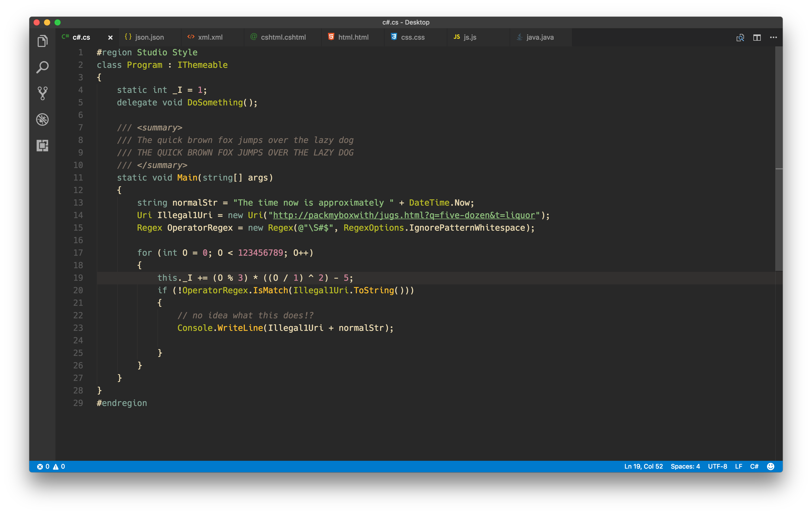
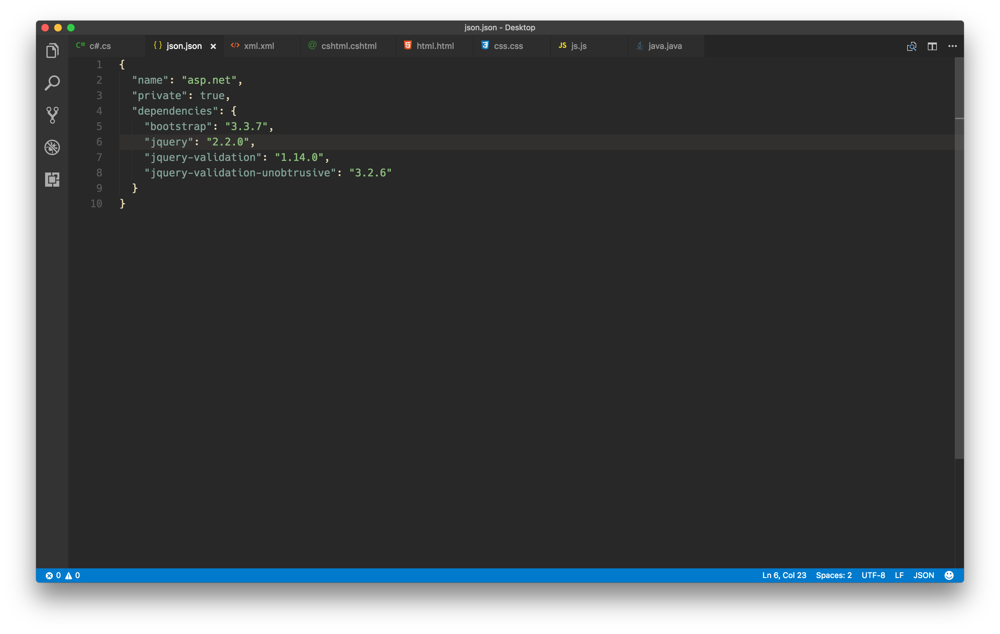
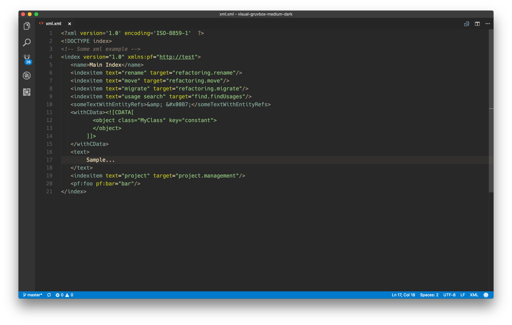

# README
## Enjoy Visual Gruvbox (Medium Dark) !

I made this theme because I didn't find one who satisfy me.

It's inspired by the Visual Studio dark theme and [Gruvbox](https://github.com/morhetz/gruvbox).

I just made little changes on the VS theme.

Also, this theme is compatible with the new [Visual Studio for Mac](https://www.visualstudio.com/vs/visual-studio-mac/)  (*I'll try to port it to Visual Studio on Windows* ).

You just have to import "`Visual Gruvbox Medium Dark.tmTheme`" ([Look at this documentation to "export" the theme](https://code.visualstudio.com/docs/extensions/yocode#_your-extensions-folder)). I did my best to make them look alike ;)

This theme is primarily for C#, HTML, CSS, XML, JSON. It works with JavaScript but maybe you'll not find that "well thinking".

I try to follow the VS dark theme logic with the Gruvbox colors : 
* Keyword, Primitive : blue
* Class : green
* Method : yellow
* String : aqua
* Numeric : purple
* Field, Variable, other text : "white beige"

*Check my [GitHub](https://github.com/rphlmr/) to find my IntelliJ port.* 

## Some screenshots
### C#

### JSON

### XML

### CSHTML

### HTML

### CSS

### JAVASCRIPT

### JAVA
